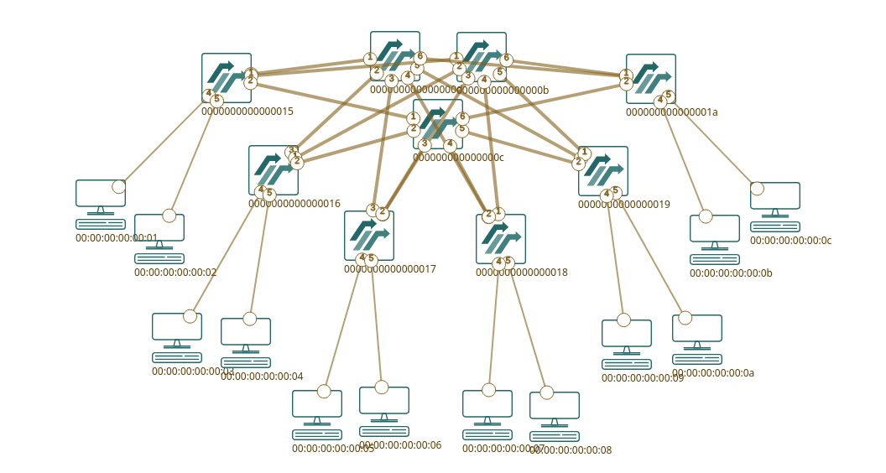

# Dynamic Flow Scheduling in Leaf Spine Topology for Data Center Networks

## Topology Used


Topology: 3 Spines, 6 Leaves, 12 Hosts.

## Project Structure

### Network Config:
Done through ```src/network_config.yaml```

Pre-defined topologies:
1) 2 Spines, 3 Leaves, 6 Hosts
2) 3 Spines, 6 Leaves, 12 Hosts (main topology)
3) 4 Spines, 10 Leaves, 20 Hosts

### Mininet Topology Generation
```src/topo/mn_spineleaf_topo.py```

Generates Topology using network_config.yaml

### Controllers
RL Controller: ```src\controller\rl_controller_x.py``` (main)

Static Controller: ```src\controller\dc_switch_1.py```

ECMP Controller ```src\controller\ecmp_controller.py```

Greedy Controller ```src\controller\greedy_controller.py```

Randomized Path Controller ```src\controller\rand_controller.py```

Round-Robin Controller ```src\controller\roundrobin_controller.py```

### RL Model
```src\rl\rl_model_x.py```

Checkpoints Saved ```checkpoints\rl_latest.pt```

Metrics Saved in ```checkpoints\```

### Traffic Generator
```src\topo\TrafficCheck.py```

## How To Run
In terminal 1 for Mininet:

```sudo PYTHONPATH="/path/to/folder/ACN/CMRL-Routing/venv/lib/python3.9/site-packages" python3 src/topo/mn_spineleaf_topo2.py src/network_config3.yaml```

For traffic Generation in Mininet Terminal:

```py exec("import sys; sys.path.append('/home/Ash/Documents/ACN/CMRL-Routing/src/topo'); from TrafficCheck import generate_traffic; generate_traffic(net)")```


In terminal 2 for Ryu:

```export PYTHONPATH=$PYTHONPATH:$(pwd)```

```NETWORK_CONFIG_FILE=src/network_config3.yaml ryu-manager --observe-links flowmanager/flowmanager.py src/controller/rl_controller_x.py```

## Flowmanager for Visualization
[flowmanager](https://github.com/martimy/flowmanager)